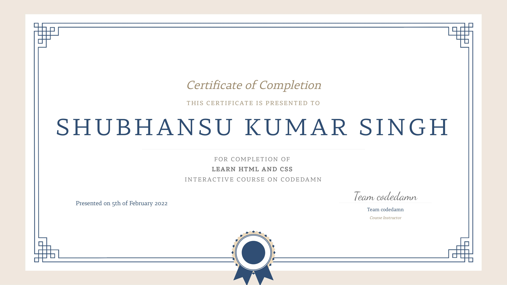

# HTML and CSS   

I took the [Codedamn's](https://codedamn.com/) [Learn HTML and CSS course](https://codedamn.com/learn/html-css) for learning the basics of Html and Css.  

Learned a lot of html tags(Can't list em' all) and Css styling properties.   

Made few basic webpages :
- Google search home page
- Subhash Chandra Bose Tribute page
- Project landing web page
- Google Form clone 

Check out my codedamn profile for code certification [@shubhansu](https://codedamn.com/user/shubhansu).

Course [Certificate](./resource/html-css-codedamn.pdf) :    
   

Course duration : 6th Jan 2022 - 5th Feb 2022.     
